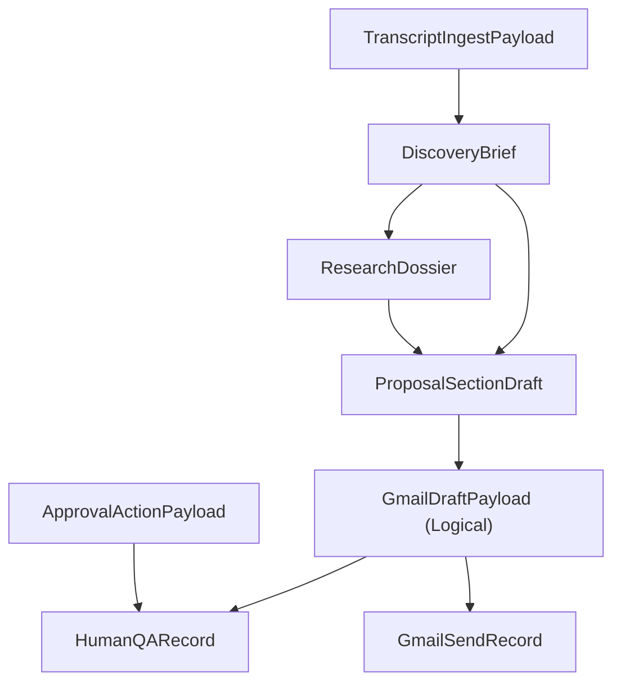

# Data Contracts

Capture payload and schema contracts between workflows and external systems.

## Contract Lineage

## Contract Definitions
### TranscriptIngestPayload
- Producer workflow/node: `transcript-intake` / Webhook (or manual trigger)
- Consumer workflow/node: `insight-extractor`
- Transport: webhook body -> n8n item JSON
- Required fields:
  - `transcript_id` (`string`) - source transcript identifier
  - `captured_at_utc` (`string`, ISO-8601) - transcript capture timestamp
  - `client_name` (`string`) - client/company name
  - `client_email` (`string`) - primary contact email
  - `website_url` (`string`) - client website for enrichment
  - `transcript_text` (`string`) - full transcript text
- Validation rules:
  - `transcript_text` cannot be empty
  - `website_url` must be valid URL format
  - On ingest, generate unique `case_id`
- Failure handling:
  - Reject payload, log error, and notify internal ops via Gmail

### DiscoveryBrief
- Producer workflow/node: `insight-extractor`
- Consumer workflow/node: `research-enricher`, `proposal-composer`
- Transport: n8n item JSON
- Required fields:
  - `case_id` (`string`) - canonical case key
  - `problem_summary` (`string`) - normalized problem statement
  - `goal_summary` (`string`) - desired outcome summary
  - `constraints` (`array[string]`) - delivery/resource constraints
  - `key_metrics` (`object`) - important numeric KPIs from transcript
- Optional fields:
  - `notable_quotes` (`array[string]`) - transcript quotes
- Validation rules:
  - Must include `case_id`, `problem_summary`, and `goal_summary`
- Failure handling:
  - Set case status to `REVISION_REQUESTED`, add activity log entry

### ResearchDossier
- Producer workflow/node: `research-enricher`
- Consumer workflow/node: `proposal-composer`
- Transport: n8n item JSON
- Required fields:
  - `case_id` (`string`)
  - `client_site_findings` (`array[string]`)
  - `competitor_findings` (`array[object]`)
  - `meta_ad_library_findings` (`array[string]`)
- Validation rules:
  - `case_id` must match existing case
- Failure handling:
  - Continue with partial dossier, flag missing portions in activity log

### ProposalSectionDraft
- Producer workflow/node: `proposal-composer`
- Consumer workflow/node: `gmail-send-and-followup`
- Transport: n8n item JSON
- Required fields:
  - `case_id` (`string`)
  - `sections` (`array[object]`) - ordered section content
  - `draft_body_markdown` (`string`) - full proposal body for Gmail draft
- Validation rules:
  - `sections` must include all required titles in exact order:
    1. `Executive Summary`
    2. `Scope of Services`
    3. `Strategy and Approach`
    4. `Budget and Pricing`
    5. `Terms and Conditions`
- Failure handling:
  - Return to `REVISION_REQUESTED` for rewrite

### GmailDraftPayload
- Producer workflow/node: `proposal-composer`
- Consumer workflow/node: `human-qa-and-approval`
- Transport: n8n item JSON + Gmail message content
- Required fields:
  - `case_id` (`string`)
  - `gmail_draft_id` (`string`, logical id in current v1)
  - `subject` (`string`)
  - `body` (`string`)

### ApprovalActionPayload
- Producer workflow/node: `human-qa-and-approval` / `QA Approval Link Webhook`
- Consumer workflow/node: `Map Approval Link Params`
- Transport: webhook query params (`GET /webhook/qa-approval-action`)
- Required fields:
  - `action` (`string`) - `approve` or `revise`
  - `case_id` (`string`)
- Optional fields:
  - `notes` (`string`)
- Validation rules:
  - Reject request if `case_id` missing.
  - Reject request if `action` not in allowed set.

### HumanQARecord
- Producer workflow/node: `human-qa-and-approval`
- Consumer workflow/node: `proposal-composer`, `gmail-send-and-followup`
- Transport: Google Sheets row + n8n item JSON
- Required fields:
  - `case_id` (`string`)
  - `qa_status` (`string`) - `APPROVED` or `REVISION_REQUESTED`
  - `founder_status` (`string`) - `APPROVED` or `REVISION_REQUESTED` or `PENDING`
  - `reviewer` (`string`)
  - `reviewed_at_utc` (`string`, ISO-8601)

### GmailSendRecord
- Producer workflow/node: `gmail-send-and-followup`
- Consumer workflow/node: Google Sheets `Activity_Log`
- Transport: Gmail API response + Sheets row
- Required fields:
  - `case_id` (`string`)
  - `gmail_message_id` (`string`)
  - `sent_at_utc` (`string`, ISO-8601)
  - `status` (`string`) - must be `SENT`

## Send Guard
- `gmail-send-and-followup` `Guard Approved Only` throws if `founder_status` is not `APPROVED`.
- This guard is mandatory and should never be bypassed in downstream workflow edits.

## Notes
- Update this whenever payload shape changes.
- Keep examples sanitized (no secrets/PII).
