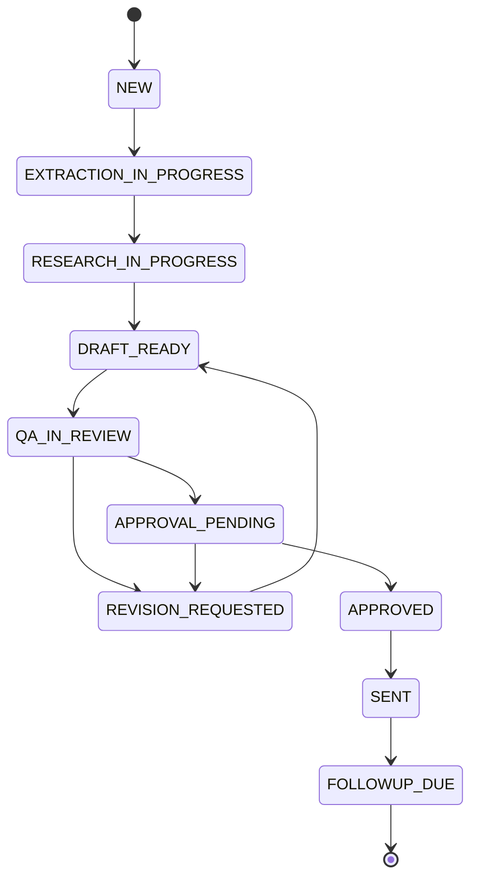

# Runbook

## Daily operations
1. Confirm core n8n workflows are active (`transcript-intake`, `insight-extractor`, `research-enricher`, `proposal-composer`, `human-qa-and-approval`, `gmail-send-and-followup`).
2. Check latest executions for failures and stalled cases.
3. Confirm `qa-approval-action` webhook is reachable from production domain.
4. Confirm Google Sheets status movement and activity logging are current.

## Lifecycle States

Use these exact statuses in Google Sheets `Cases` and `Proposals` tabs.

## Safe rerun procedures
- Intake rerun scope: rerun only for affected `case_id`; do not create a new case for existing transcript.
- Extraction/research rerun scope: rerun failed node chain from latest good state for that `case_id`.
- Composition/QA rerun scope: preserve `case_id`, keep revision history, overwrite only current draft payload.
- Send rerun scope: only rerun send for `APPROVED` cases without confirmed send timestamp.
- Backfill approach: enqueue historical transcripts through `NEW` -> `DRAFT_READY`, then process QA/approval in priority order.

## Fixture-based first test
1. Use `fixtures/transcript_ingest_payload.glossier.json` as intake source payload.
2. Confirm generated draft contains sections in this exact order:
   - `Executive Summary`
   - `Scope of Services`
   - `Strategy and Approach`
   - `Budget and Pricing`
   - `Terms and Conditions`
3. Confirm only `founder_status=APPROVED` reaches Gmail send.
4. Confirm `case_id` remains `case-call-2026-03-05-glossier` through revision loops.

## Incident response
1. Identify failing node/workflow.
2. Capture `case_id`, payload snapshot, and error details.
3. Set case to holding state (`REVISION_REQUESTED` or prior stable state) if needed.
4. Apply fix in n8n or credentials.
5. Re-run minimal scope for the affected `case_id`.
6. Confirm downstream consistency in Gmail and Google Sheets.

## Webhook troubleshooting
1. If API checks pass but `POST /webhook/<path>` or `GET /webhook/<path>` returns `404`, verify the public webhook base URL configured in n8n.
2. Trigger using the exact production URL shown in the Webhook node panel in n8n UI.
3. For QA approval links, verify:
   - workflow `human-qa-and-approval` is active
   - node `QA Approval Link Webhook` exists with path `qa-approval-action` and method `GET`
   - live workflow webhook nodes have non-null `webhookId`
4. If `webhookId` is null, re-deploy workflow JSON and re-activate workflow.

## Change rollout checklist
- [ ] Update workflow JSON in repo.
- [ ] Publish to n8n.
- [ ] Verify active/schedules.
- [ ] Update docs/changelog.
