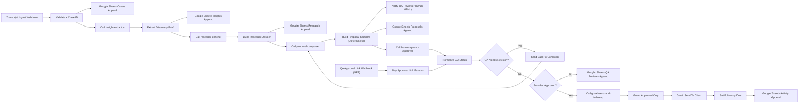

# System Overview

## Purpose
Convert a discovery transcript into a personalized proposal draft in Gmail, route through human QA and founder approval, then send to the client while tracking SLA and delivery state in Google Sheets.

## In Scope
- Transcript-first intake (no Instagram intake in v1)
- Deterministic insight extraction and research dossier construction
- Deterministic proposal section composition using the current 5-section template
- Gmail QA HTML review email, founder approval action, and Gmail send
- Case and activity tracking in Google Sheets
- Approval/revision loop back to composer

## Out of Scope
- Automated client send without human QA/founder approval
- AI-agent autonomous writing (v1 is deterministic code)
- PDF export/rendering workflow in v1

## Upstream Dependencies
- n8n instance
- transcript source payload (webhook/manual)
- Google Sheets credentials in n8n
- Gmail credentials in n8n

## Downstream Outputs
- Google Sheets case state, timestamps, and activity logs
- Gmail QA review email with action links
- Gmail final client send record

## Runtime Model
- Main entrypoint: `POST /webhook/transcript-intake`
- Runtime chaining uses `Execute Workflow` between all stages.
- Proposal writer is deterministic code (`Build Proposal Sections`), not an AI agent.
- QA approval button hits `GET /webhook/qa-approval-action` and feeds into QA normalization.
- Send stage is hard-guarded to approved-only by `Guard Approved Only`.

## End-to-End Flow

## Section Mapping (Current v1)
Composer output must include these sections in this exact order:
1. `Executive Summary`
2. `Scope of Services`
3. `Strategy and Approach`
4. `Budget and Pricing`
5. `Terms and Conditions`

## Fixture Inputs
- Transcript fixture source: `/Users/app/Downloads/discovery_call_glossier.docx`
- Template section source: `/Users/app/Downloads/Copy of Marketing Proposal Template.pdf`
- Repo fixtures:
  - `fixtures/transcript_ingest_payload.glossier.json`
  - `fixtures/discovery_brief.expected.glossier.json`
  - `fixtures/proposal_section_draft.expected.glossier.json`

## Webhook Base Note
- API base and webhook base may differ by deployment.
- Current approval links use `https://webhooks.intellom8.com/webhook/qa-approval-action`.
- If you receive `webhook not registered` errors, re-check workflow activation and webhook URL domain.

## Ownership
- Business owner:
- Technical owner:
- Escalation path:
